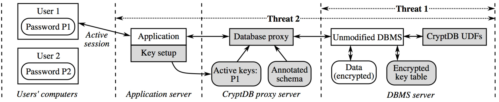
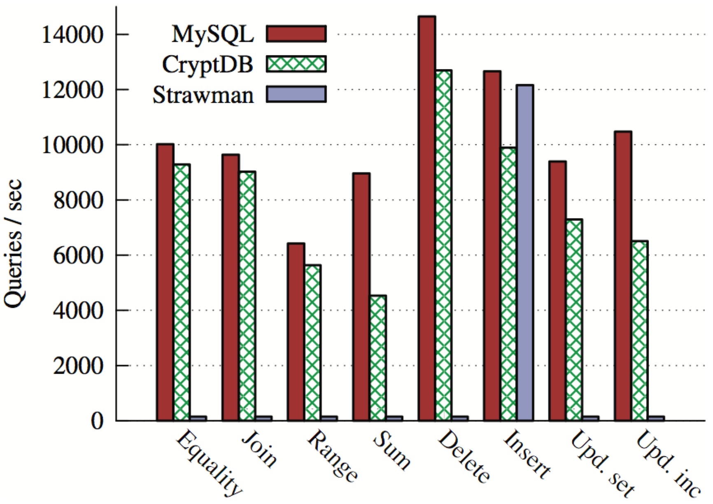
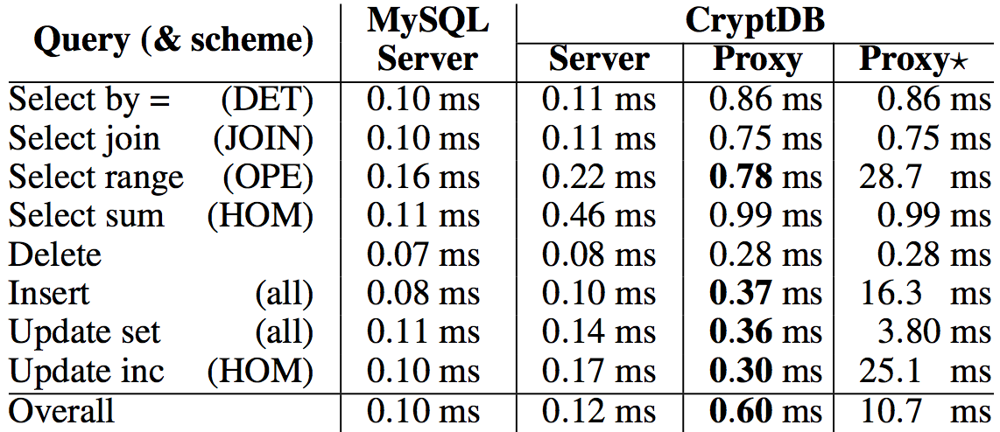
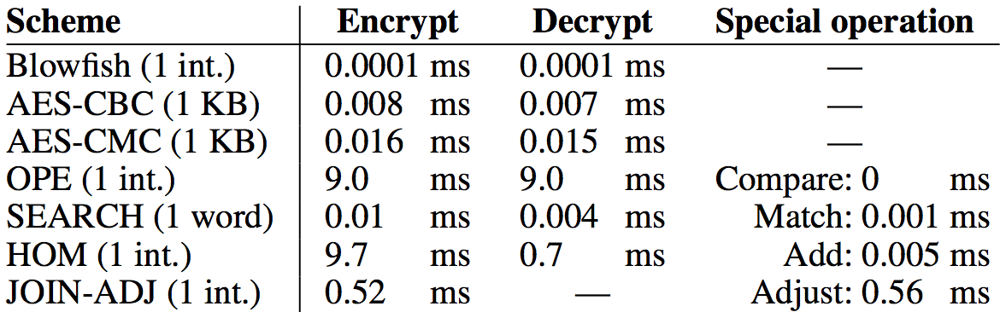
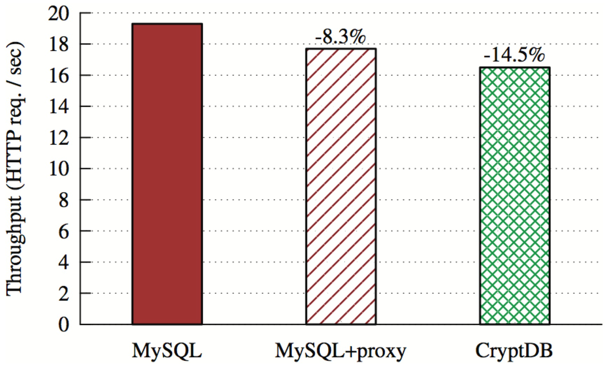

**Paper source:**  <http://web.mit.edu/ralucap/www/CryptDB-sosp11.pdf>  
> **Copyright:**  Permission to make digital or hard copies of part or all of this work for personal or classroom use is granted without fee provided that copies are not made or distributed for profit or commercial advantage and that copies bear this notice and the full citation on the first page. Copyrights for components of this work owned by others than ACM must be honored. Abstracting with credit is permitted. To copy otherwise, to republish, to post on servers or to redistribute to lists, requires prior specific permission and/or a fee.
SOSP ’11, October 23–26, 2011, Cascais, Portugal. Copyright 2011 ACM 978-1-4503-0977-6/11/10 . . . $10.00.

CryptDB: Protecting Confidentiality with Encrypted Query Processing
========
Raluca Ada Popa, Catherine M. S. Redfield, Nickolai Zeldovich, and Hari Balakrishnan

*MIT CSAIL*

ABSTRACT
--------
Online applications are vulnerable to theft of sensitive information because adversaries can exploit software bugs to gain access to private data, and because curious or malicious administrators may capture and leak data. CryptDB is a system that provides practical and provable confidentiality in the face of these attacks for applications backed by SQL databases. It works by *executing SQL queries over encrypted data* using a collection of efficient SQL-aware encryption schemes. CryptDB can also *chain encryption keys to user passwords*, so that a data item can be decrypted only by using the password of one of the users with access to that data. As a result, a database administrator never gets access to decrypted data, and even if all servers are compromised, an adversary cannot decrypt the data of any user who is not logged in. An analysis of a trace of 126 million SQL queries from a production MySQL server shows that CryptDB can support operations over encrypted data for 99.5% of the 128,840 columns seen in the trace. Our evaluation shows that CryptDB has low overhead, reducing throughput by 14.5% for phpBB, a web forum application, and by 26% for queries from TPCC, compared to unmodified MySQL. Chaining encryption keys to user passwords requires 11–13 unique schema annotations to secure more than 20 sensitive fields and 2–7 lines of source code changes for three multi-user web applications.

**Categories and Subject Descriptors:** H.2.7 [**Database Management**]: Database Administration—Security, integrity, and protection.

**General Terms:** Security, design.

1 INTRODUCTION
--------
Theft of private information is a significant problem, particularly for online applications [40]. An adversary can exploit software vulnerabilities to gain unauthorized access to servers [32]; curious or malicious administrators at a hosting or application provider can snoop on private data [6]; and attackers with physical access to servers can access all data on disk and in memory [23].

One approach to reduce the damage caused by server compromises is to encrypt sensitive data, as in SUNDR [28], SPORC [16], and Depot [30], and run all computations (application logic) on clients. Unfortunately, several important applications do not lend themselves to this approach, including database-backed web sites that process queries to generate data for the user, and applications that compute over large amounts of data. Even when this approach is tenable, converting an existing server-side application to this form can be difficult. Another approach would be to consider theoretical solutions such as fully homomorphic encryption [19], which allows servers to compute arbitrary functions over encrypted data, while only clients see decrypted data. However, fully homomorphic encryption schemes are still prohibitively expensive by orders of magnitude [10, 21].

This paper presents CryptDB, a system that explores an intermediate design point to provide confidentiality for applications that use database management systems (DBMSes). CryptDB leverages the typical structure of database-backed applications, consisting of a DBMS server and a separate application server, as shown in Figure 1; the latter runs the application code and issues DBMS queries on behalf of one or more users. CryptDB’s approach is to *execute queries over encrypted data*, and the key insight that makes it practical is that SQL uses a well-defined set of operators, each of which we are able to support efficiently over encrypted data.


> **Figure 1:** CryptDB’s architecture consisting of two parts: a *database proxy* and an unmodified *DBMS*. CryptDB uses user-defined functions (UDFs) to perform cryptographic operations in the DBMS. Rectangular and rounded boxes represent processes and data, respectively. Shading indicates components added by CryptDB. Dashed lines indicate separation between users’ computers, the application server, a server running CryptDB’s database proxy (which is usually the same as the application server), and the DBMS server. CryptDB addresses two kinds of threats, shown as dotted lines. In threat 1, a curious database administrator with complete access to the DBMS server snoops on private data, in which case CryptDB prevents the DBA from accessing any private information. In threat 2, an adversary gains complete control over both the software and hardware of the application, proxy, and DBMS servers, in which case CryptDB ensures the adversary cannot obtain data belonging to users that are not logged in (e.g., user 2).

CryptDB addresses two threats. The first threat is a curious database administrator (DBA) who tries to learn private data (e.g., health records, financial statements, personal information) by snooping on the DBMS server; here, CryptDB prevents the DBA from learning private data. The second threat is an adversary that gains complete control of application and DBMS servers. In this case, CryptDB cannot provide any guarantees for users that are logged into the application during an attack, but can still ensure the confidentiality of logged-out users’ data.

There are two challenges in combating these threats. The first lies in the tension between minimizing the amount of confidential information revealed to the DBMS server and the ability to efficiently execute a variety of queries. Current approaches for computing over encrypted data are either too slow or do not provide adequate confidentiality, as we discuss in §9. On the other hand, encrypting data with a strong and efficient cryptosystem, such as AES, would prevent the DBMS server from executing many SQL queries, such as queries that ask for the number of employees in the “sales” department or for the names of employees whose salary is greater than $60,000. In this case, the only practical solution would be to give the DBMS server access to the decryption key, but that would allow an adversary to also gain access to all data.

The second challenge is to minimize the amount of data leaked when an adversary compromises the application server in addition to the DBMS server. Since arbitrary computation on encrypted data is not practical, the application must be able to access decrypted data. The difficulty is thus to ensure that a compromised application can obtain only a limited amount of decrypted data. A naive solution of assigning each user a different database encryption key for their data does not work for applications with shared data, such as bulletin boards and conference review sites.

CryptDB addresses these challenges using three key ideas:

* The first is to execute SQL queries over encrypted data.CryptDB implements this idea using a *SQL-aware encryption strategy*, which leverages the fact that all SQL queries are made up of a well-defined set of primitive operators, such as equality checks, order comparisons, aggregates (sums), and joins. By adapting known encryption schemes (for equality, additions, and order checks) and using a new privacy-preserving cryptographic method for joins, CryptDB encrypts each data item in a way that allows the DBMS to execute on the transformed data. CryptDB is efficient because it mostly uses symmetric-key encryption, avoids fully homomorphic encryption, and runs on unmodified DBMS software (by using user-defined functions).
* The second technique is *adjustable query-based encryption*. Some encryption schemes leak more information than others about the data to the DBMS server, but are required to process certain queries. To avoid revealing all possible encryptions of data to the DBMS *a priori*, CryptDB carefully *adjusts* the SQL-aware encryption scheme for any given data item, depending on the queries observed at run-time. To implement these adjustments efficiently, CryptDB uses *onions of encryption*. Onions are a novel way to compactly store multiple ciphertexts within each other in the database and avoid expensive re-encryptions.
* The third idea is to *chain encryption keys to user passwords*,so that each data item in the database can be decrypted only through a chain of keys rooted in the password of one of the users with access to that data. As a result, if the user is not logged into the application, and if the adversary does not know the user’s password, the adversary cannot decrypt the user’s data, even if the DBMS and the application server are fully compromised. To construct a chain of keys that captures the application’s data privacy and sharing policy, CryptDB allows the developer to provide policy annotations over the application’s SQL schema, specifying which users (or other principals, such as groups) have access to each data item.

We have implemented CryptDB on both MySQL and Postgres; our design and most of our implementation should be applicable to most standard SQL DBMSes. An analysis of a 10-day trace of 126 million SQL queries from many applications at MIT suggests that CryptDB can support operations over encrypted data for 99.5% of the 128,840 columns seen in the trace. Our evaluation shows that CryptDB has low overhead, reducing throughput by 14.5% for the phpBB web forum application, and by 26% for queries from TPC-C, compared to unmodified MySQL. We evaluated the security of CryptDB on six real applications (including phpBB, the HotCRP conference management software [27], and the OpenEMR medical records application); the results show that CryptDB protects most sensitive fields with highly secure encryption schemes. Chaining encryption keys to user passwords requires 11–13 unique schema annotations to enforce privacy policies on more than 20 sensitive fields (including a new policy in HotCRP for handling papers in conflict with a PC chair) and 2–7 lines of source code changes for three multi-user web applications.

The rest of this paper is structured as follows. In §2, we discuss the threats that CryptDB defends against in more detail. Then, we describe CryptDB’s design for encrypted query processing in §3 and for key chaining to user passwords in §4. In §5, we present several case studies of how applications can use CryptDB, and in §6, we discuss limitations of our design, and ways in which it can be extended. Next, we describe our prototype implementation in §7, and evaluate the performance and security of CryptDB, as well as the effort required for application developers to use CryptDB, in §8. We compare CryptDB to related work in §9 and conclude in §10.

2 SECURITY OVERVIEW
--------
Figure 1 shows CryptDB’s architecture and threat models. CryptDB works by intercepting all SQL queries in a *database proxy*, which rewrites queries to execute on encrypted data (CryptDB assumes that all queries go through the proxy). The proxy encrypts and decrypts all data, and changes some query operators, while preserving the semantics of the query. The DBMS server never receives decryption keys to the plaintext so it never sees sensitive data, ensuring that a curious DBA cannot gain access to private information (threat 1).

To guard against application, proxy, and DBMS server compromises (threat 2), developers annotate their SQL schema to define different *principals*, whose keys will allow decrypting different parts of the database. They also make a small change to their applications to provide encryption keys to the proxy, as described in §4. The proxy determines what parts of the database should be encrypted under what key. The result is that CryptDB guarantees the confidentiality of data belonging to users that are not logged in during a compromise (e.g., user 2 in Figure 1), and who do not log in until the compromise is detected and fixed by the administrator.

Although CryptDB protects data confidentiality, it does not ensure the integrity, freshness, or completeness of results returned to the application. An adversary that compromises the application, proxy, or DBMS server, or a malicious DBA, can delete any or all of the data stored in the database. Similarly, attacks on user machines, such as cross-site scripting, are outside of the scope of CryptDB.

We now describe the two threat models addressed by CryptDB, and the security guarantees provided under those threat models.

####2.1 Threat 1: DBMS Server Compromise
In this threat, CryptDB guards against a curious DBA or other external attacker with full access to the data stored in the DBMS server. Our goal is confidentiality (data secrecy), not integrity or availability. The attacker is assumed to be *passive*: she wants to learn confidential data, but does not change queries issued by the application, query results, or the data in the DBMS. This threat includes DBMS software compromises, root access to DBMS machines, and even access to the RAM of physical machines. With the rise in database consolidation inside enterprise data centers, outsourcing of databases to public cloud computing infrastructures, and the use of third-party DBAs, this threat is increasingly important.

**Approach.**  CryptDB aims to protect data confidentiality against this threat by executing SQL queries over encrypted data on the DBMS server. The proxy uses secret keys to encrypt all data inserted or included in queries issued to the DBMS. Our approach is to allow the DBMS server to perform query processing on encrypted data as it would on an unencrypted database, by enabling it to compute certain functions over the data items based on encrypted data. For example, if the DBMS needs to perform a GROUP BY on column *c*, the DBMS server should be able to determine which items in that column are equal to each other, but not the actual content of each item. Therefore, the proxy needs to enable the DBMS server to determine relationships among data necessary to process a query. By using SQL-aware encryption that adjusts dynamically to the queries presented, CryptDB is careful about what relations it reveals between tuples to the server. For instance, if the DBMS needs to perform only a GROUP BY on a column *c*, the DBMS server should not know the order of the items in column *c*, nor should it know any other information about other columns. If the DBMS is required to perform an ORDER BY, or to find the MAX or MIN, CryptDB reveals the order of items in that column, but not otherwise.

**Guarantees.** CryptDB provides confidentiality for data content and for names of columns and tables; CryptDB does not hide the overall table structure, the number of rows, the types of columns, or the approximate size of data in bytes. The security of CryptDB is *not perfect:* CryptDB reveals to the DBMS server relationships among data items that correspond to the *classes of computation* that queries perform on the database, such as comparing items for equality, sorting, or performing word search. The granularity at which CryptDB allows the DBMS to perform a class of computations is an entire column (or a group of joined columns, for joins), which means that even if a query requires equality checks for a few rows, executing that query on the server would require revealing that class of computation for an entire column. §3.1 describes how these classes of computation map to CryptDB’s encryption schemes, and the information they reveal.

More intuitively, CryptDB provides the following properties:

* Sensitive data is never available in plaintext at the DBMS server.
* The information revealed to the DBMS server depends on the classes of computation required by the application’s queries, subject to constraints specified by the application developer in the schema (§3.5.1):
	1. If the application requests no relational predicate filtering on a column, nothing about the data content leaks (other than its size in bytes).
	2. If the application requests equality checks on a column, CryptDB’s proxy reveals which items repeat in that column (the histogram), but not the actual values.
	3. If the application requests order checks on a column, the proxy reveals the order of the elements in the column.
* The DBMS server cannot compute the (encrypted) results for queries that involve computation classes not requested by the application.

How close is CryptDB to “optimal” security? Fundamentally, optimal security is achieved by recent work in theoretical cryptography enabling any computation over encrypted data [18]; however, such proposals are prohibitively impractical. In contrast, CryptDB is practical, and in §8.3, we demonstrate that it also provides significant security in practice. Specifically, we show that all or almost all of the most sensitive fields in the tested applications remain encrypted with highly secure encryption schemes. For such fields, CryptDB provides optimal security, assuming their value is independent of the pattern in which they are accessed (which is the case for medical information, social security numbers, etc). CryptDB is not optimal for fields requiring more revealing encryption schemes, but we find that most such fields are semi-sensitive (such as timestamps).

Finally, we believe that a passive attack model is realistic because malicious DBAs are more likely to read the data, which may be hard to detect, than to change the data or query results, which is more likely to be discovered. In §9, we cite related work on data integrity that could be used in complement with our work. An active adversary that can insert or update data may be able to indirectly compromise confidentiality. For example, an adversary that modifies an email field in the database may be able to trick the application into sending a user’s data to the wrong email address, when the user asks the application to email her a copy of her own data. Such active attacks on the DBMS fall under the second threat model, which we now discuss.

####2.2 Threat 2: Arbitrary Threats
We now describe the second threat where the application server, proxy, and DBMS server infrastructures may be compromised arbitrarily. The approach in threat 1 is insufficient because an adversary can now get access to the keys used to encrypt the entire database.

The solution is to encrypt different data items (e.g., data belonging to different users) with different keys. To determine the key that should be used for each data item, developers annotate the application’s database schema to express finer-grained confidentiality policies. A curious DBA still cannot obtain private data by snooping on the DBMS server (threat 1), and in addition, an adversary who compromises the application server or the proxy can now decrypt only data of currently logged-in users (which are stored in the proxy). Data of currently inactive users would be encrypted with keys not available to the adversary, and would remain confidential.

In this configuration, CryptDB provides strong guarantees in the face of *arbitrary* server-side compromises, including those that gain root access to the application or the proxy. CryptDB leaks at most the data of currently active users for the duration of the compromise, even if the proxy behaves in a Byzantine fashion. By
“duration of a compromise”, we mean the interval from the start of the compromise until any trace of the compromise has been erased from the system. For a read SQL injection attack, the duration of the compromise spans the attacker’s SQL queries. In the above example of an adversary changing the email address of a user in the database, we consider the system compromised for as long as the attacker’s email address persists in the database.

3 QUERIES OVER ENCRYPTED DATA
--------
This section describes how CryptDB executes SQL queries over encrypted data. The threat model in this section is threat 1 from §2.1. The DBMS machines and administrators are not trusted, but the application and the proxy are trusted.

CryptDB enables the DBMS server to execute SQL queries on encrypted data almost as if it were executing the same queries on plaintext data. Existing applications do not need to be changed. The DBMS’s query plan for an encrypted query is typically the same as for the original query, except that the operators comprising the query, such as selections, projections, joins, aggregates, and orderings, are performed on ciphertexts, and use modified operators in some cases.

CryptDB’s proxy stores a secret master key *MK*, the database schema, and the current encryption layers of all columns. The DBMS server sees an anonymized schema (in which table and column names are replaced by opaque identifiers), encrypted user data, and some auxiliary tables used by CryptDB. CryptDB also equips the server with CryptDB-specific user-defined functions (UDFs) that enable the server to compute on ciphertexts for certain operations.

Processing a query in CryptDB involves four steps:

1. The application issues a query, which the proxy intercepts and rewrites: it anonymizes each table and column name, and, using the master key *MK*, encrypts each constant in the query with an encryption scheme best suited for the desired operation (§3.1).
2. The proxy checks if the DBMS server should be given keys to adjust encryption layers before executing the query, and if so, issues an UPDATE query at the DBMS server that invokes a UDF to adjust the encryption layer of the appropriate columns (§3.2).
3. The proxy forwards the encrypted query to the DBMS server, which executes it using standard SQL (occasionally invoking UDFs for aggregation or keyword search).
4. The DBMS server returns the (encrypted) query result, which the proxy decrypts and returns to the application.

####3.1 SQL-aware Encryption
We now describe the encryption types that CryptDB uses, including a number of existing cryptosystems, an optimization of a recent scheme, and a new cryptographic primitive for joins. For each encryption type, we explain the security property that CryptDB requires from it, its functionality, and how it is implemented.


> **Figure 2:** Onion encryption layers and the classes of computation they allow. Onion names stand for the operations they allow at some of their layers (Equality, Order, Search, and Addition). In practice, some onions or onion layers may be omitted, depending on column types or schema annotations provided by application developers (§3.5.2). DET and JOIN are often merged into a single onion layer, since JOIN is a concatenation of DET and JOIN-ADJ (§3.4). A random IV for RND (§3.1), shared by the RND layers in *Eq* and *Ord*, is also stored for each data item.

**Random (RND).**  RND provides the maximum security in CryptDB: indistinguishability under an adaptive chosen-plaintext attack (IND-CPA); the scheme is probabilistic, meaning that two equal values are mapped to different ciphertexts with overwhelming probability. On the other hand, RND does not allow any computation to be performed efficiently on the ciphertext. An efficient construction of RND is to use a block cipher like AES or Blowfish in CBC mode together with a random initialization vector (IV). (We mostly use AES, except for integer values, where we use Blowfish for its 64-bit block size because the 128-bit block size of AES would cause the ciphertext to be significantly longer).

Since, in this threat model, CryptDB assumes the server does not change results, CryptDB does not require a stronger IND-CCA2 construction (which would be secure under a chosen-ciphertext attack). However, it would be straightforward to use an IND-CCA2-secure implementation of RND instead, such as a block cipher in UFE mode [13], if needed.

**Deterministic (DET).**  DET has a slightly weaker guarantee, yet it still provides strong security: it leaks only which encrypted values correspond to the same data value, by deterministically generating the same ciphertext for the same plaintext. This encryption layer allows the server to perform equality checks, which means it can perform selects with equality predicates, equality joins, GROUP BY, COUNT, DISTINCT, etc.

In cryptographic terms, DET should be a pseudo-random permutation (PRP) [20]. For 64-bit and 128-bit values, we use a block cipher with a matching block size (Blowfish and AES respectively); we make the usual assumption that the AES and Blowfish block ciphers are PRPs. We pad smaller values out to 64 bits, but for data that is longer than a single 128-bit AES block, the standard CBC mode of operation leaks prefix equality (e.g., if two data items have an identical prefix that is at least 128 bits long). To avoid this problem, we use AES with a variant of the CMC mode [24], which can be approximately thought of as one round of CBC, followed by another round of CBC with the blocks in the reverse order. Since the goal of DET is to reveal equality, we use a zero IV (or “tweak” [24]) for our AES-CMC implementation of DET.

**Order-preserving encryption (OPE).**  OPE allows order relations between data items to be established based on their encrypted values, without revealing the data itself. If x < y, then OPE<sub>*K*</sub>(x) < OPE<sub>*K*</sub>(y), for any secret key *K*. Therefore, if a column is encrypted with OPE, the server can perform range queries when given encrypted constants OPE<sub>*K*</sub>(c1) and OPE<sub>*K*</sub>(c2) corresponding to the range [c1, c2]. The server can also perform ORDER BY, MIN, MAX, SORT, etc.

OPE is a weaker encryption scheme than DET because it reveals order. Thus, the CryptDB proxy will only reveal OPE-encrypted columns to the server if users request order queries on those columns. OPE has provable security guarantees [4]: the encryption is equivalent to a random mapping that preserves order.

The scheme we use [4] is the first provably secure such scheme. Until CryptDB, there was no implementation nor any measure of the practicality of the scheme. The direct implementation of the scheme took 25 ms per encryption of a 32-bit integer on an Intel 2.8 GHz Q9550 processor. We improved the algorithm by using AVL binary search trees for batch encryption (e.g., database loads), reducing the cost of OPE encryption to 7 ms per encryption without affecting its security. We also implemented a hypergeometric sampler that lies at the core of OPE, porting a Fortran implementation from 1988 [25].

**Homomorphic encryption (HOM).**  HOM is a secure probabilistic encryption scheme (IND-CPA secure), allowing the server to perform computations on encrypted data with the final result decrypted at the proxy. While fully homomorphic encryption is prohibitively slow [10], homomorphic encryption for specific operations is efficient. To support summation, we implemented the Paillier cryptosystem [35]. With Paillier, multiplying the encryptions of two values results in an encryption of the sum of the values, i.e., HOM<sub>*K*</sub>(x) · HOM<sub>*K*</sub>(y) = HOM<sub>*K*</sub>(x + y), where the multiplication is performed modulo some public-key value. To compute SUM aggregates, the proxy replaces SUM with calls to a UDF that performs Paillier multiplication on a column encrypted with HOM. HOM can also be used for computing averages by having the DBMS server return the sum and the count separately, and for incrementing values (e.g., SET *id*=*id*+1), on which we elaborate shortly.

With HOM, the ciphertext is 2048 bits. In theory, it should be possible to pack multiple values from a single row into one HOM ciphertext for that row, using the scheme of Ge and Zdonik [17], which would result in an amortized space overhead of 2× (e.g., a 32-bit value occupies 64 bits) for a table with many HOM-encrypted columns. However, we have not implemented this optimization in our prototype. This optimization would also complicate partial-row UPDATE operations that reset some—but not all—of the values packed into a HOM ciphertext.

**Join (JOIN and OPE-JOIN).**  A separate encryption scheme is necessary to allow equality joins between two columns, because we use different keys for DET to prevent cross-column correlations. JOIN also supports all operations allowed by DET, and also enables the server to determine repeating values between two columns. OPE-JOIN enables joins by order relations. We provide a new cryptographic scheme for JOIN and we discuss it in §3.4.

**Word search (SEARCH).**  SEARCH is used to perform searches on encrypted text to support operations such as MySQL’s LIKE operator. We implemented the cryptographic protocol of Song et al. [46], which was not previously implemented by the authors; we also use their protocol in a different way, which results in better security guarantees. For each column needing SEARCH, we split the text into keywords using standard delimiters (or using a special keyword extraction function specified by the schema developer). We then remove repetitions in these words, randomly permute the positions of the words, and then encrypt each of the words using Song et al.’s scheme, padding each word to the same size. SEARCH is nearly as secure as RND: the encryption does not reveal to the DBMS server whether a certain word repeats in multiple rows, but it leaks the number of keywords encrypted with SEARCH; an adversary may be able to estimate the number of distinct or duplicate words (e.g., by comparing the size of the SEARCH and RND ciphertexts for the same data).

When the user performs a query such as SELECT * FROM *messages* WHERE *msg* LIKE "% alice %", the proxy gives the DBMS server a token, which is an encryption of alice. The server cannot decrypt the token to figure out the underlying word. Using a user-defined function, the DBMS server checks if any of the word encryptions in any message match the token. In our approach, all the server learns from searching is whether a token matched a message or not, and this happens only for the tokens requested by the user. The server would learn the same information when returning the result set to the users, so the overall search scheme reveals the minimum amount of additional information needed to return the result.

Note that SEARCH allows CryptDB to only perform full-word keyword searches; it cannot support arbitrary regular expressions. For applications that require searching for multiple adjacent words, CryptDB allows the application developer to disable duplicate removal and re-ordering by annotating the schema, even though this is not the default. Based on our trace evaluation, we find that most uses of LIKE can be supported by SEARCH with such schema annotations. Of course, one can still combine multiple LIKE operators with AND and OR to check whether multiple independent words are in the text.

####3.2 Adjustable Query-based Encryption
A key part of CryptDB’s design is *adjustable query-based encryption*, which dynamically adjusts the layer of encryption on the DBMS server. Our goal is to use the most secure encryption schemes that enable running the requested queries. For example, if the application issues no queries that compare data items in a column, or that sort a column, the column should be encrypted with RND. For columns that require equality checks but not inequality checks, DET suffices. However, the query set is not always known in advance. Thus, we need an adaptive scheme that dynamically adjusts encryption strategies.

Our idea is to encrypt each data item in one or more *onions*: that is, each value is dressed in layers of increasingly stronger encryption, as illustrated in Figures 2 and 3. Each layer of each onion enables certain kinds of functionality as explained in the previous subsection. For example, outermost layers such as RND and HOM provide maximum security, whereas inner layers such as OPE provide more functionality.

Multiple onions are needed in practice, both because the computations supported by different encryption schemes are not always strictly ordered, and because of performance considerations (size of ciphertext and encryption time for nested onion layers). Depending on the type of the data (and any annotations provided by the application developer on the database schema, as discussed in §3.5.2), CryptDB may not maintain all onions for each column. For instance, the *Search* onion does not make sense for integers, and the *Add* onion does not make sense for strings.

For each layer of each onion, the proxy uses the same key for encrypting values in the same column, and different keys across tables, columns, onions, and onion layers. Using the same key for all values in a column allows the proxy to perform operations on a column without having to compute separate keys for each row that will be manipulated. (We use finer-grained encryption keys in §4 to reduce the potential amount of data disclosure in case of an application or proxy server compromise.) Using different keys across columns prevents the server from learning any additional relations. All of these keys are derived from the master key *MK*. For example, for table *t*, column *c*, onion *o*, and encryption layer *l*, the proxy uses the key  
&nbsp;&nbsp;&nbsp;&nbsp; *K*<sub>*t,c,o,l*</sub> = PRP<sub>*MK*</sub>(table *t*, column *c*, onion *o*, layer *l*), (1)  
where PRP is a pseudorandom permutation (e.g., AES).

Each onion starts out encrypted with the most secure encryption scheme (RND for onions *Eq* and *Ord*, HOM for onion *Add*, and SEARCH for onion *Search*). As the proxy receives SQL queries from the application, it determines whether layers of encryption need to be removed. Given a predicate *P* on column *c* needed to execute a query on the server, the proxy first establishes what onion layer is needed to compute *P* on *c*. If the encryption of c is not already at an onion layer that allows *P*, the proxy strips off the onion layers to allow *P* on *c*, by sending the corresponding onion key to the server. The proxy never decrypts the data past the least-secure encryption onion layer (or past some other threshold layer, if specified by the application developer in the schema, §3.5.1).

CryptDB implements onion layer decryption using UDFs that run on the DBMS server. For example, in Figure 3, to decrypt onion Ord of column 2 in table 1 to layer OPE, the proxy issues the following query to the server using the DECRYPT RND UDF:  
UPDATE *Table1* SET *C2-Ord* = DECRYPT RND(K, *C2-Ord*, *C2-IV*)  
where *K* is the appropriate key computed from Equation (1). At the same time, the proxy updates its own internal state to remember that column *C2-Ord* in *Table1* is now at layer OPE in the DBMS. Each column decryption should be included in a transaction to avoid consistency problems with clients accessing columns being adjusted.

Note that onion decryption is performed entirely by the DBMS server. In the steady state, no server-side decryptions are needed, because onion decryption happens only when a new class of computation is requested on a column. For example, after an equality check is requested on a column and the server brings the column to layer DET, the column remains in that state, and future queries with equality checks require no decryption. This property is the insight into why CryptDB’s overhead is modest in the steady state (see §8): the server mostly performs typical SQL processing.

**_Employees_** |_
--------|--------
*ID*    |*Name*
23      |Alice

**_Table1_** |_|_|_|_|_|_|_
------- |-------  |--------  |-------   |-------  |-------- |--------  |--------
*C1-IV* |*C1-Eq*  |*C1-Ord*  |*C1-Add*  |*C2-IV*  |*C2-Eq*  |*C2-Ord*  |*C2-Search*
x27c3   |x2b82    |xcb94     |xc2e4     |x8a13    |xd1e3    |x7eb1     |x29b0

>Figure 3: Data layout at the server. When the application creates the table shown on the left, the table created at the DBMS server is the one shown on the right. Ciphertexts shown are not full-length.

####3.3 Executing over Encrypted Data
Once the onion layers in the DBMS are at the layer necessary to execute a query, the proxy transforms the query to operate on these onions. In particular, the proxy replaces column names in a query with corresponding onion names, based on the class of computation performed on that column. For example, for the schema shown in Figure 3, a reference to the *Name* column for an equality comparison will be replaced with a reference to the C2-Eq column.

The proxy also replaces each constant in the query with a corresponding onion encryption of that constant, based on the computation in which it is used. For instance, if a query contains WHERE Name = ‘Alice’, the proxy encrypts ‘Alice’ by successively applying all encryption layers corresponding to onion Eq that have not yet been removed from C2-Eq.

Finally, the server replaces certain operators with UDF-based counterparts. For instance, the SUM aggregate operator and the + column-addition operator must be replaced with an invocation of a UDF that performs HOM addition of ciphertexts. Equality and order operators (such as = and <) do not need such replacement and can be applied directly to the DET and OPE ciphertexts.

Once the proxy has transformed the query, it sends the query to the DBMS server, receives query results (consisting of encrypted data), decrypts the results using the corresponding onion keys, and sends the decrypted result to the application.

**Read query execution.**  To understand query execution over ciphertexts, consider the example schema shown in Figure 3. Initially, each column in the table is dressed in all onions of encryption, with RND, HOM, and SEARCH as outermost layers, as shown in Figure 2. At this point, the server can learn nothing about the data other than the number of columns, rows, and data size.

To illustrate when onion layers are removed, consider the query:  
SELECT *ID* FROM *Employees* WHERE *Name* = ‘Alice’,  
which requires lowering the encryption of *Name* to layer DET. To
execute this query, the proxy first issues the query  
UPDATE *Table1* SET *C2-Eq* = DECRYPT RND(*K<sub>T1,C2,Eq,RND</sub>*, C2-Eq, C2-IV),  
where column C2 corresponds to *Name*. The proxy then issues  
SELECT *C1-Eq*, *C1-IV* FROM *Table1* WHERE *C2-Eq* = x7..d,  
where column *C1* corresponds to *ID*, and where x7..d is the *Eq* onion encryption of “Alice” with keys *K*<sub>*T1,C2,Eq*,JOIN</sub> and *K*<sub>*T1,C2,Eq*,DET</sub> (see Figure 2). Note that the proxy must request the random IV from column C1-IV in order to decrypt the RND ciphertext from C1-Eq. Finally, the proxy decrypts the results from the server using keys *K*<sub>*T1,C1,Eq*,RND</sub>, *K*<sub>*T1,C1,Eq*,DET</sub>, and *K*<sub>*T1,C1,Eq*,JOIN</sub>, obtains the result 23, and returns it to the application.

If the next query is SELECT COUNT(\*) FROM *Employees* WHERE *Name* = ‘Bob’, no server-side decryptions are necessary, and the proxy directly issues the query SELECT COUNT(\*) FROM *Table1* WHERE *C2-Eq* = xbb..4a,wherexbb..4aistheEqonion encryption of “Bob” using *K*<sub>*T1,C2,Eq*,JOIN</sub> and *K*<sub>*T1,C2,Eq*,DET</sub>.

**Write query execution.**  To support INSERT, DELETE, and UPDATE queries, the proxy applies the same processing to the predicates (i.e., the WHERE clause) as for read queries. DELETE queries require no additional processing. For all INSERT and UPDATE queries that set the value of a column to a constant, the proxy encrypts each inserted column’s value with each onion layer that has not yet been stripped off in that column.

The remaining case is an UPDATE that sets a column value based on an existing column value, such as *salary*=*salary*+1. Such an update would have to be performed using HOM, to handle additions. However, in doing so, the values in the OPE and DET onions would become stale. In fact, any hypothetical encryption scheme that simultaneously allows addition and direct comparison on the ciphertext is insecure: if a malicious server can compute the order of the items, and can increment the value by one, the server can repeatedly add one to each field homomorphically until it becomes equal to some other value in the same column. This would allow the server to compute the difference between any two values in the database, which is almost equivalent to knowing their values.

There are two approaches to allow updates based on existing column values. If a column is incremented and then only projected (no comparisons are performed on it), the solution is simple: when a query requests the value of this field, the proxy should request the HOM ciphertext from the *Add* onion, instead of ciphertexts from other onions, because the HOM value is up-to-date. For instance, this approach applies to increment queries in TPC-C. If a column is used in comparisons after it is incremented, the solution is to replace the update query with two queries: a SELECT of the old values to be updated, which the proxy increments and encrypts accordingly, followed by an UPDATE setting the new values. This strategy would work well for updates that affect a small number of rows.

**Other DBMS features.**  Most other DBMS mechanisms, such as transactions and indexing, work the same way with CryptDB over encrypted data as they do over plaintext, with no modifications. For transactions, the proxy passes along any BEGIN, COMMIT, and ABORT queries to the DBMS. Since many SQL operators behave differently on NULLs than on non-NULL values, CryptDB exposes NULL values to the DBMS without encryption. CryptDB does not currently support stored procedures, although certain stored procedures could be supported by rewriting their code in the same way that CryptDB’s proxy rewrites SQL statements.

The DBMS builds indexes for encrypted data in the same way as for plaintext. Currently, if the application requests an index on a column, the proxy asks the DBMS server to build indexes on that column’s DET, JOIN, OPE, or OPE-JOIN onion layers (if they are exposed), but not for RND, HOM, or SEARCH. More efficient index selection algorithms could be investigated.

####3.4 Computing Joins
There are two kinds of joins supported by CryptDB: *equi-joins*, in which the join predicate is based on equality, and range joins, which involve order checks. To perform an equi-join of two encrypted columns, the columns should be encrypted with the same key so that the server can see matching values between the two columns. At the same time, to provide better privacy, the DBMS server should not be able to join columns for which the application did not request a join, so columns that are never joined should not be encrypted with the same keys.

If the queries that can be issued, or the pairs of columns that can be joined, are known *a priori*, equi-join is easy to support: CryptDB can use the DET encryption scheme with the same key for each group of columns that are joined together. §3.5 describes how the proxy learns the columns to be joined in this case. However, the challenging case is when the proxy does not know the set of columns to be joined *a priori*, and hence does not know which columns should be encrypted with matching keys.

To solve this problem, we introduce a new cryptographic primitive, JOIN-ADJ (*adjustable join*), which allows the DBMS server to adjust the key of each column at runtime. Intuitively, JOIN-ADJ can be thought of as a keyed cryptographic hash with the additional property that hashes can be adjusted to change their key *without access to the plaintext*. JOIN-ADJ is a deterministic function of its input, which means that if two plaintexts are equal, the corresponding JOIN-ADJ values are also equal. JOIN-ADJ is collision-resistant, and has a sufficiently long output length (192 bits) to allow us to assume that collisions never happen in practice.

JOIN-ADJ is non-invertible, so we define the JOIN encryption scheme as JOIN(*v*) = JOIN-ADJ(*v*) || DET(*v*), where || denotes concatenation. This construction allows the proxy to decrypt a JOIN(*v*) column to obtain v by decrypting the DET component, and allows the DBMS server to check two JOIN values for equality by comparing the JOIN-ADJ components.

Each column is initially encrypted at the JOIN layer using a different key, thus preventing any joins between columns. When a query requests a join, the proxy gives the DBMS server an onion key to adjust the JOIN-ADJ values in one of the two columns, so that it matches the JOIN-ADJ key of the other column (denoted the *join-base* column). After the adjustment, the columns share the same JOIN-ADJ key, allowing the DBMS server to join them for equality. The DET components of JOIN remain encrypted with different keys.

Note that our adjustable join is transitive: if the user joins columns *A* and *B* and then joins columns *B* and *C*, the server can join *A* and *C*. However, the server cannot join columns in different “transitivity groups”. For instance, if columns *D* and *E* were joined together, the DBMS server would not be able to join columns *A* and *D* on its own.

After an initial join query, the JOIN-ADJ values remain transformed with the same key, so no re-adjustments are needed for subsequent join queries between the same two columns. One exception is if the application issues another query, joining one of the adjusted columns with a third column, which causes the proxy to readjust the column to another join-base. To avoid oscillations and to converge to a state where all columns in a transitivity group share the same join-base, CryptDB chooses the first column in lexicographic order on table and column name as the join-base. For n columns, the overall maximum number of join transitions is n(n − 1)/2.

For range joins, a similar dynamic re-adjustment scheme is difficult to construct due to lack of structure in OPE schemes. Instead, CryptDB requires that pairs of columns that will be involved in such joins be declared by the application ahead of time, so that matching keys are used for layer OPE-JOIN of those columns; otherwise, the same key will be used for all columns at layer OPE-JOIN. Fortunately, range joins are rare; they are not used in any of our example applications, and are used in only 50 out of 128,840 columns in a large SQL query trace we describe in §8, corresponding to just three distinct applications.

JOIN-ADJ construction. Our algorithm uses elliptic-curve cryptography (ECC). JOIN-ADJK (*v*) is computed as  
JOIN-ADJ<sub>*K*</sub>(*v*) := P<sup>*K*·PRF<sub>K0</sub>(*v*)</sup>, (2)  
where *K* is the initial key for that table, column, onion, and layer, *P* is a point on an elliptic curve (being a public parameter), and PRF<sub>*K*<sub>0</sub></sub> is a pseudo-random function [20] mapping values to a pseudorandom number, such as AES<sub>*K*<sub>0</sub></sub> (SHA(*v*)), with *K*<sub>0</sub> being a key that is the same for all columns and derived from *MK*. The “exponentiation” is in fact repeated geometric addition of elliptic curve points; it is considerably faster than RSA exponentiation.
When a query joins columns *c* and *c*‘, each having keys *K* and *K*’ at the join layer, the proxy computes ∆*K* = *K*/*K*‘ (in an appropriate group) and sends it to the server. Then, given JOIN-ADJ<sub>*K*‘</sub> (v) (the JOIN-ADJ values from column *c*’) and ∆K, the DBMS server uses a UDF to adjust the key in c‘ by computing:  
(JOIN-ADJ<sub>*K*‘</sub>(*v*))<sup>∆*K*</sup> = P<sup>*K*‘·PRF<sub>K<sub>0</sub></sub> (v)·(K/K‘)</sup> = P<sup>*K*·PRF<sub>K0</sub>(*v*)</sub> = JOIN-ADJ<sub>*K*</sub>(*v*).  
Now columns *c* and *c*‘ share the same JOIN-ADJ key, and the DBMS server can perform an equi-join on *c* and *c*‘ by taking the JOIN-ADJ component of the JOIN onion ciphertext.

At a high level, the security of this scheme is that the server cannot infer join relations among groups of columns that were not requested by legitimate join queries, and that the scheme does not reveal the plaintext. We proved the security of this scheme based on the standard Elliptic-Curve Decisional Diffie-Hellman hardness assumption, and implemented it using a NIST-approved elliptic curve. We plan to publish a more detailed description of this algorithm and the proof on our web site [37].

####3.5 Improving Security and Performance
Although CryptDB can operate with an unmodified and unannotated schema, as described above, its security and performance can be improved through several optional optimizations, as described below.

#####3.5.1 *Security Improvements*
**Minimum onion layers.**  Application developers can specify the lowest onion encryption layer that may be revealed to the server for a specific column. In this way, the developer can ensure that the proxy will not execute queries exposing sensitive relations to the server. For example, the developer could specify that credit card numbers should always remain at RND or DET.

**In-proxy processing.**  Although CryptDB can evaluate a number of predicates on the server, evaluating them in the proxy can improve security by not revealing additional information to the server. One common use case is a SELECT query that sorts on one of the selected columns, without a LIMIT on the number of returned columns. Since the proxy receives the entire result set from the server, sorting these results in the proxy does not require a significant amount of computation, and does not increase the bandwidth requirements. Doing so avoids revealing the OPE encryption of that column to the server.

**Training mode.**  CryptDB provides a training mode, which allows a developer to provide a trace of queries and get the resulting onion encryption layers for each field, along with a warning in case some query is not supported. The developer can then examine the resulting encryption levels to understand what each encryption scheme leaks, as described in §2.1. If some onion level is too low for a sensitive field, she should arrange to have the query processed in the proxy (as described above), or to process the data in some other fashion, such as by using a local instance of SQLite.

**Onion re-encryption.**  In cases when an application performs infrequent queries requiring a low onion layer (e.g., OPE), CryptDB could be extended to re-encrypt onions back to a higher layer after the infrequent query finishes executing. This approach reduces leakage to attacks happening in the time window when the data is at the higher onion layer.

#####3.5.2 *Performance Optimizations*
**Developer annotations.**  By default, CryptDB encrypts all fields and creates all applicable onions for each data item based on its type. If many columns are not sensitive, the developer can instead provide explicit annotations indicating the sensitive fields (as described in §4), and leave the remaining fields in plaintext.

**Known query set.**  If the developer knows some of the queries ahead of time, as is the case for many web applications, the developer can use the training mode described above to adjust onions to the correct layer *a priori*, avoiding the overhead of runtime onion adjustments. If the developer provides the exact query set, or annotations that certain functionality is not needed on some columns, CryptDB can also discard onions that are not needed (e.g., discard the Ord onion for columns that are not used in range queries, or discard the *Search* onion for columns where keyword search is not performed), discard onion layers that are not needed (e.g., the adjustable JOIN layer, if joins are known *a priori*), or discard the random IV needed for RND for some columns.

**Ciphertext pre-computing and caching.**  The proxy spends a significant amount of time encrypting values used in queries with OPE and HOM. To reduce this cost, the proxy pre-computes (for HOM) and caches (for OPE) encryptions of frequently used constants under different keys. Since HOM is probabilistic, ciphertexts cannot be reused. Therefore, in addition, the proxy pre-computes HOM’s Paillier *r<sup>n</sup>* randomness values for future encryptions of any data. This optimization reduces the amount of CPU time spent by the proxy on OPE encryption, and assuming the proxy is occasionally idle to perform HOM pre-computation, it removes HOM encryption from the critical path.

4 MULTIPLE PRINCIPALS
--------
We now extend the threat model to the case when the application infrastructure and proxy are also untrusted (threat 2). This model is especially relevant for a multi-user web site running a web and application server. To understand both the problems faced by a multi-user web application and CryptDB’s solution to these problems, consider phpBB, a popular online web forum. In phpBB, each user has an account and a password, belongs to certain groups, and can send private messages to other users. Depending on their groups’ permissions, users can read entire forums, only forum names, or not be able to read a forum at all.

There are several confidentiality guarantees that would be useful in phpBB. For example, we would like to ensure that a private message sent from one user to another is not visible to anyone else; that posts in a forum are accessible only to users in a group with access to that forum; and that the name of a forum is shown only to users belonging to a group that’s allowed to view it. CryptDB provides these guarantees in the face of arbitrary compromises, thereby limiting the damage caused by a compromise.

Achieving these guarantees requires addressing two challenges. First, CryptDB must capture the application’s access control policy for shared data at the level of SQL queries. To do this, CryptDB requires developers to annotate their database schema to specify principals and the data that each principal has access to, as described in §4.1.

The second challenge is to reduce the amount of information that an adversary can gain by compromising the system. Our solution limits the leakage resulting from a compromised application or proxy server to just the data accessible to users who were logged in during the compromise. In particular, the attacker cannot access the data of users that were not logged in during the compromise. Leaking the data of active users in case of a compromise is unavoidable: given the impracticality of arbitrary computation on encrypted data, some data for active users must be decrypted by the application.

In CryptDB, each user has a key (e.g., her application-level password) that gives her access to her data. CryptDB encrypts different data items with different keys, and enforces the access control policy using chains of keys starting from user passwords and ending in the encryption keys of SQL data items, as described in §4.2. When a user logs in, she provides her password to the proxy (via the application). The proxy uses this password to derive onion keys to process queries on encrypted data, as presented in the previous section, and to decrypt the results. The proxy can decrypt only the data that the user has access to, based on the access control policy. The proxy gives the decrypted data to the application, which can now compute on it. When the user logs out, the proxy deletes the user’s key.


####4.1 Policy Annotations
To express the data privacy policy of a database-backed application at the level of SQL queries, the application developer can annotate the schema of a database in CryptDB by specifying, for any subset of data items, which *principal* has access to it. A principal is an entity, such as a user or a group, over which it is natural to specify an access policy. Each SQL query involving an annotated data item requires the privilege of the corresponding principal. CryptDB defines its own notion of principals instead of using existing DBMS principals for two reasons: first, many applications do not map application-level users to DBMS principals in a sufficiently fine-grained manner, and second, CryptDB requires explicit delegation of privileges between principals that is difficult to extract in an automated way from an access control list specification.

An application developer annotates the schema using the three steps described below and illustrated in Figure 4. In all examples we show, italics indicate table and column names, and bold text indicates annotations added for CryptDB.

*Step 1*. The developer must define the principal types (using PRINCTYPE) used in her application, such as users, groups, or messages. A principal is an instance of a principal type, e.g., principal 5 of type user. There are two classes of principals: external and internal. External principals correspond to end users who explicitly authenticate themselves to the application using a password. When a user logs into the application, the application must provide the user password to the proxy so that the user can get the privileges of her external principal. Privileges of other (internal) principals can be acquired only through delegation, as described in Step 3. When the user logs out, the application must inform the proxy, so that the proxy forgets the user’s password as well as any keys derived from the user’s password.

*Step 2*. The developer must specify which columns in her SQL schema contain sensitive data, along with the principals that should have access to that data, using the ENC FOR annotation. CryptDB requires that for each private data item in a row, the name of the principal that should have access to that data be stored in another column in the same row. For example, in Figure 4, the decryption of *msgtext* x37a21f is available only to principal 5 of type msg.

*Step 3*. Programmers can specify rules for how to delegate the privileges of one principal to other principals, using the speaks-for relation [49]. For example, in phpBB, a user should also have the privileges of the groups she belongs to. Since many applications store such information in tables, programmers can specify to CryptDB how to infer delegation rules from rows in an existing table. In particular, programmers can annotate a table *T* with (*a* x) SPEAKS FOR (*b* y). This annotation indicates that each row present in that table specifies that principal *a* of type x speaks for principal *b* of type y, meaning that *a* has access to all keys that *b* has access to. Here, x and y must always be fixed principal types. Principal *b* is always specified by the name of a column in table *T* . On the other hand, *a* can be either the name of another column in the same table, a constant, or *T2.col*, meaning *all* principals from column *col* of table *T2*. For example, in Figure 4, principal “Bob” of type physical user speaks for principal 2 of type user, and in Figure 6, all principals in the *contactId* column from table *PCMember* (of type contact) speak for the *paperId* principal of type review. Optionally, the programmer can specify a predicate, whose inputs are values in the same row, to specify a condition under which delegation should occur, such as excluding conflicts in Figure 6. §5 provides more examples of using annotations to secure applications.

***
```
PRINCTYPE physical user EXTERNAL;  
PRINCTYPE user, msg;

CREATE TABLE privmsgs (  
  msgid int,  
  subject varchar(255) ENC_FOR (msgid msg),  
  msgtext text ENC_FOR (msgid msg) );
  
CREATE TABLE privmsgs_to (  
  msgid int, rcpt_id int, sender_id int,  
  (sender_id user) SPEAKS_FOR (msgid msg),  
  (rcpt_id user) SPEAKS_FOR (msgid msg) );

CREATE TABLE users (  
  userid int, username varchar(255),  
  (username physical_user) SPEAKS_FOR (userid user) );  
```
Example table contents, without anonymized column names:

Table *privmsgs* |_|_
--------|--------|--------
msgid   |subject |msgtext
5       |xcc82fa |x37a21f


Table *privmsgs_to* |_|_
--------|--------|--------
msgid   |rcpt_id |sender_id
5       |1       |2


Table *users* |_
--------|--------
userid  |username
1       |‘Alice’ 
2       |‘Bob’
***
>**Figure4:** PartofphpBB’sschemawithannotationstosecureprivate messages. Only the sender and receiver may see the private message. An attacker that gains complete access to phpBB and the DBMS can access private messages of only currently active users.

####4.2 Key Chaining
Each principal (i.e., each instance of each principal type) is associated with a secret, randomly chosen key. If principal *B* speaks for principal *A* (as a result of some SPEAKS FOR annotation), then principal *A*’s key is encrypted using principal *B*’s key, and stored as a row in the special *access_keys* table in the database. This allows principal *B* to gain access to principal *A*’s key. For example, in Figure 4, to give users 1 and 2 access to message 5, the key of msg 5 is encrypted with the key of user 1, and also separately encrypted with the key of user 2.

Each sensitive field is encrypted with the key of the principal in the ENC FOR annotation. CryptDB encrypts the sensitive field with onions in the same way as for single-principal CryptDB, except that onion keys are derived from a principal’s key as opposed to a global master key.

The key of each principal is a combination of a symmetric key and a public–private key pair. In the common case, CryptDB uses the symmetric key of a principal to encrypt any data and other principals’ keys accessible to this principal, with little CPU cost. However, this is not always possible, if some principal is not currently online. For example, in Figure 4, suppose Bob sends message 5 to Alice, but Alice (user 1) is not online. This means that CryptDB does not have access to user 1’s key, so it will not be able to encrypt message 5’s key with user 1’s symmetric key. In this case, CryptDB looks up the public key of the principal (i.e., user 1) in a second table, public keys, and encrypts message 5’s key using user 1’s public key. When user 1 logs in, she will be able to use the secret key part of her key to decrypt the key for message 5 (and re-encrypt it under her symmetric key for future use).

For external principals (i.e., physical users), CryptDB assigns a random key just as for any other principal. To give an external user access to the corresponding key on login, CryptDB stores the key of each external principal in a third table, *external_keys*, encrypted with the principal’s password. This allows CryptDB to obtain a user’s key given the user’s password, and also allows a user to change her password without changing the key of the principal.

When a table with a SPEAKS FOR relation is updated, CryptDB must update the *access_keys* table accordingly. To insert a new row into *access_keys* for a new SPEAKS FOR relation, the proxy must have access to the key of the principal whose privileges are being delegated. This means that an adversary that breaks into an application or proxy server cannot create new SPEAKS FOR relations for principals that are not logged in, because neither the proxy nor the adversary have access to their keys. If a SPEAKS FOR relation is removed, CryptDB revokes access by removing the corresponding row from *access_keys*.

When encrypting data in a query or decrypting data from a result, CryptDB follows key chains starting from passwords of users logged in until it obtains the desired keys. As an optimization, when a user logs in, CryptDB’s proxy loads the keys of some principals to which the user has access (in particular, those principal types that do not have too many principal instances—e.g., for groups the user is in, but not for messages the user received).

Applications inform CryptDB of users logging in or out by issuing INSERT and DELETE SQL queries to a special table cryptdb active that has two columns, *username* and *password*. The proxy intercepts all queries for *cryptdb_active*, stores the passwords of logged-in users in memory, and never reveals them to the DBMS server.

CryptDB guards the data of inactive users at the time of an attack. If a compromise occurs, CryptDB provides a bound on the data leaked, allowing the administrators to not issue a blanket warning to all the users of the system. In this respect, CryptDB is different from other approaches to database security (see §9). However, some special users such as administrators with access to a large pool of data enable a larger compromise upon an attack. To avoid attacks happening when the administrator is logged in, the administrator should create a separate user account with restricted permissions when accessing the application as a regular user. Also, as good practice, an application should automatically log out users who have been inactive for some period of time.

5 APPLICATION CASE STUDIES
--------
In this section, we explain how CryptDB can be used to secure three existing multi-user web applications. For brevity, we show simplified schemas, omitting irrelevant fields and type specifiers. Overall, we find that once a programmer specifies the principals in the application’s schema, and the delegation rules for them using SPEAKS FOR, protecting additional sensitive fields just requires additional ENC FOR annotations.

**phpBB** is a widely used open source forum with a rich set of access control settings. Users are organized in groups; both users and groups have a variety of access permissions that the application administrator can choose. We already showed how to secure private messages between two users in phpBB in Figure 4. A more detailed case is securing access to posts, as shown in Figure 5. This example shows how to use predicates (e.g., IF *optionid*=...) to implement a conditional speaks-for relation on principals, and also how one column (*forumid*) can be used to represent multiple principals (of different type) with different privileges. There are more ways to gain access to a post, but we omit them here for brevity.

```
PRINCTYPE physical user EXTERNAL; 
PRINCTYPE user, group, forum_post, forum_name;

CREATE TABLE users (
  userid int, username varchar(255),
  (username physical_user) SPEAKS_FOR (userid user) );

CREATE TABLE usergroup (
  userid int, groupid int, 
  (userid user) SPEAKS_FOR (groupid group) );

CREATE TABLE aclgroups ( 
  groupid int, forumid int, optionid int, 
  (groupid group) SPEAKS_FOR (forumid forum_post) IF optionid=20,
  (groupid group) SPEAKS_FOR (forumid forum_name) IF optionid=14);

CREATE TABLE posts (
  postid int, forumid int,
  post text ENC_FOR (forumid forum_post) );

CREATE TABLE forum ( 
  forumid int,
  name varchar(255) ENC_FOR (forumid forum_name) );
```
>Figure 5: Annotated schema for securing access to posts in phpBB. A user has access to see the content of posts in a forum if any of the groups that the user is part of has such permissions, indicated by *optionid* 20 in the *aclgroups* table for the corresponding *forumid* and *groupid*. Similarly, *optionid* 14 enables users to see the forum’s name.

**HotCRP** is a popular conference review application [27]. A key policy for HotCRP is that PC members cannot see who reviewed their own (or conflicted) papers. Figure 6 shows CryptDB annotations for HotCRP’s schema to enforce this policy. Today, HotCRP cannot prevent a curious or careless PC chair from logging into the database server and seeing who wrote each review for a paper that she is in conflict with. As a result, conferences often set up a second server to review the chair’s papers or use inconvenient out-of-band emails. With CryptDB, a PC chair cannot learn who wrote each review for her paper, even if she breaks into the application or database, since she does not have the decryption key.[^1] The reason is that the SQL predicate “NoConflict” checks if a PC member is conflicted with a paper and prevents the proxy from providing access to the PC chair in the key chain. (We assume the PC chair does not modify the application to log the passwords of other PC members to subvert the system.)

[^1]: Fully implementing this policy would require setting up two PC chairs: a main chair, and a backup chair responsible for reviews of the main chair’s papers. HotCRP allows the PC chair to impersonate other PC members, so CryptDB annotations would be used to prevent the main chair from gaining access to keys of reviewers assigned to her paper.

**grad-apply** is a graduate admissions system used by MIT EECS. We annotated its schema to allow an applicant’s folder to be accessed only by the respective applicant and any faculty using (*reviewers.reviewer_id reviewer*), meaning all reviewers, SPEAKS FOR (*candidate_id* candidate) in table candidates, and ... SPEAKS_FOR (*letter_id* letter) in table *letters*. The applicant can see all of her folder data except for letters of recommendation. Overall, grad-apply has simple access control and therefore simple annotations.

```
PRINCTYPE physical_user EXTERNAL; 
PRINCTYPE contact, review;

CREATE TABLE ContactInfo (
  contactId int, email varchar(120), 
  (email physical user) SPEAKS_FOR (contactId contact) );

CREATE TABLE PCMember ( contactId int );
CREATE TABLE PaperConflict ( paperId int, contactId int ); 
CREATE TABLE PaperReview (
  paperId int,
  reviewerId int ENC_FOR(paperIdreview),
  commentsToPC text ENC_FOR (paperId review), 
  (PCMember.contactId contact) SPEAKS_FOR (paperId review) IF NoConflict(paperId, contactId) );

NoConflict (paperId, contactId): /* Define a SQL function */
  (SELECT COUNT(*) FROM PaperConflict c WHERE
    c.paperId = paperId AND c.contactId = contactId) = 0;
```
>Figure 6: Annotated schema for securing reviews in HotCRP. Reviews and the identity of reviewers providing the review will be available only to PC members (table *PCMember* includes PC chairs) who are not conflicted, and PC chairs cannot override this restriction.

6 DISCUSSION
--------
CryptDB’s design supports most relational queries and aggregates on standard data types, such as integers and text/varchar types. Additional operations can be added to CryptDB by extending its existing onions, or adding new onions for specific data types (e.g., spatial and multi-dimensional range queries [43]). Alternatively, in some cases, it may be possible to map complex unsupported operation to simpler ones (e.g., extracting the month out of an encrypted date is easier if the date’s day, month, and year fields are encrypted separately).

There are certain computations CryptDB cannot support on encrypted data. For example, it does not support both computation and comparison on the same column, such as WHERE *salary* > *age*\*2+10. CryptDB can process a part of this query, but it would also require some processing on the proxy. In CryptDB, such a query should be (1) rewritten into a sub-query that selects a whole column, SELECT *age**2+10 FROM ..., which CryptDB computes using HOM, and (2) re-encrypted in the proxy, creating a new column (call it *aux*) on the DBMS server consisting of the newly encrypted values. Finally, the original query with the predicate WHERE *salary* > *aux* should be run. We have not been affected by this limitation in our test applications (TPC-C, phpBB, HotCRP, and grad-apply).

In multi-principal mode, CryptDB cannot perform server-side computations on values encrypted for different principals, even if the application has the authority of all principals in question, because the ciphertexts are encrypted with different keys. For some computations, it may be practical for the proxy to perform the computation after decrypting the data, but for others (e.g., large-scale aggregates) this approach may be too expensive. A possible extension to CryptDB to support such queries may be to maintain multiple ciphertexts for such values, encrypted under different keys.

7 IMPLEMENTATION
--------
The CryptDB proxy consists of a C++ library and a Lua module. The C++ library consists of a query parser; a query encryptor/rewriter, which encrypts fields or includes UDFs in the query; and a result decryption module. To allow applications to transparently use CryptDB, we used MySQL proxy [47] and implemented a Lua module that passes queries and results to and from our C++ module. We implemented our new cryptographic protocols using NTL [44]. Our CryptDB implementation consists of ∼18,000 lines of C++ code and ∼150 lines of Lua code, with another ∼10,000 lines of test code.

CryptDB is portable and we have implemented versions for both Postgres 9.0 and MySQL 5.1. Our initial Postgres-based implementation is described in an earlier technical report [39]. Porting CryptDB to MySQL required changing only 86 lines of code, mostly in the code for connecting to the MySQL server and declaring UDFs. As mentioned earlier, CryptDB does not change the DBMS; we implement all server-side functionality with UDFs and server-side tables. CryptDB’s design, and to a large extent our implementation, should work on top of any SQL DBMS that supports UDFs.

8 EXPERIMENTAL EVALUATION
--------
In this section, we evaluate four aspects of CryptDB: the difficulty of modifying an application to run on top of CryptDB, the types of queries and applications CryptDB is able to support, the level of security CryptDB provides, and the performance impact of using CryptDB. For this analysis, we use seven applications as well as a large trace of SQL queries.

We evaluate the effectiveness of our annotations and the needed application changes on the three applications we described in §5 (phpBB, HotCRP, and grad-apply), as well as on a TPC-C query mix (a standard workload in the database industry). We then analyze the functionality and security of CryptDB on three more applications, on TPC-C, and on a large trace of SQL queries. The additional three applications are OpenEMR, an electronic medical records application storing private medical data of patients; the web application of an MIT class (6.02), storing students’ grades; and PHP-calendar, storing people’s schedules. The large trace of SQL queries comes from a popular MySQL server at MIT, sql.mit.edu. This server is used primarily by web applications running on scripts.mit.edu, a shared web application hosting service operated by MIT’s Student Information Processing Board (SIPB). In addition, this SQL server is used by a number of applications that run on other machines and use sql.mit.edu only to store their data. Our query trace spans about ten days, and includes approximately 126 million queries. Figure 7 summarizes the schema statistics for sql.mit.edu; each database is likely to be a separate instance of some application.

_               |**Databases**|**Tables**|**Columns**
----------------|--------:    |--------: |--------:
Complete schema |8,548        |177,154   |1,244,216
Used in query   |1,193        |18,162    |128,840

>Figure 7: Number of databases, tables, and columns on the sql.mit.edu MySQL server, used for trace analysis, indicating the total size of the schema, and the part of the schema seen in queries during the trace period.

Finally, we evaluate the overall performance of CryptDB on the phpBB application and on a query mix from TPC-C, and perform a detailed analysis through microbenchmarks.

In the six applications (not counting TPC-C), we only encrypt sensitive columns, according to a manual inspection. Some fields were clearly sensitive (e.g., grades, private message, medical information), but others were only marginally so (e.g., the time when a message was posted). There was no clear threshold between sensitive or not, but it was clear to us which fields were definitely sensitive. In the case of TPC-C, we encrypt all the columns in the database in single-principal mode so that we can study the performance and functionality of a fully encrypted DBMS. All fields are considered for encryption in the large query trace as well.

####8.1 Application Changes
Figure 8 summarizes the amount of programmer effort required to use CryptDB in three multi-user web applications and in the single-principal TPC-C queries. The results show that, for multi-principal mode, CryptDB required between 11 and 13 unique schema annotations (29 to 111 in total), and 2 to 7 lines of code changes to provide user passwords to the proxy, in order to secure sensitive information stored in the database. Part of the simplicity is because securing an additional column requires just one annotation in most cases. For the single-principal TPC-C queries, using CryptDB required no application annotations at all.

Application     |Annotations    |Login/logout|Sensitive fields secured, and examples of such fields
----------------|---------------|--------    |----------------
phpBB           |31 (11 unique) |7 lines     |23: private messages (content, subject), posts, forums
HotCRP          |29 (12 unique) |2 lines     |22: paper content and paper information, reviews
grad-apply      |111 (13 unique)|2 lines     |103: student grades (61),scores (17),recommendations,reviews
TPC-C (single princ.)|0         |0           |92: all the fields in all the tables encrypted
>Figure 8: Number of annotations the programmer needs to add to secure sensitive fields, lines of code to be added to provide CryptDB with the passwords of users, and the number of sensitive fields that CryptDB secures with these annotations, for three different applications. We count as one annotation each invocation of our three types of annotations and any SQL predicate used in a SPEAKS FOR annotation. Since multiple fields in the same table are usually encrypted for the same principal (e.g., message subject and content), we also report unique annotations.

####8.2 Functional Evaluation
To evaluate what columns, operations, and queries CryptDB can support, we analyzed the queries issued by six web applications (including the three applications we analyzed in §8.1), the TPC-C queries, and the SQL queries from sql.mit.edu. The results are shown in the left half of Figure 9.


>Figure 9: Steady-state onion levels for database columns required by a range of applications and traces. “Needs plaintext” indicates that CryptDB cannot execute the application’s queries over encrypted data for that column. For the applications in the top group of rows, sensitive columns were determined manually, and only these columns were considered for encryption. For the bottom group of rows, all database columns were automatically considered for encryption. The rightmost column considers the application’s most sensitive database columns, and reports the number of them that have MinEnc in HIGH (both terms are defined in §8.3).

CryptDB supports most queries; the number of columns in the “needs plaintext” column, which counts columns that cannot be processed in encrypted form by CryptDB, is small relative to the total number of columns. For PHP-calendar and OpenEMR, CryptDB does not support queries on certain sensitive fields that perform string manipulation (e.g., substring and lowercase conversions) or date manipulation (e.g., obtaining the day, month, or year of an encrypted date). However, if these functions were precomputed with the result added as standalone columns (e.g., each of the three parts of a date were encrypted separately), CryptDB would support these queries.

The next two columns, “needs HOM” and “needs SEARCH”, reflect the number of columns for which that encryption scheme is needed to process some queries. The numbers suggest that these encryption schemes are important; without these schemes, CryptDB would be unable to support those queries.

Based on an analysis of the larger sql.mit.edu trace, we found that CryptDB should be able to support operations over all but 1,094 of the 128,840 columns observed in the trace. The “in-proxy processing” shows analysis results where we assumed the proxy can perform some lightweight operations on the results returned from the DBMS server. Specifically, this included any operations that are not needed to compute the set of resulting rows or to aggregate rows (that is, expressions that do not appear in a WHERE, HAVING, or GROUP BY clause, or in an ORDER BY clause with a LIMIT, and are not aggregate operators). With in-proxy processing, CryptDB should be able to process queries over encrypted data over all but 571 of the 128,840 columns, thus supporting 99.5% of the columns.

Of those 571 columns, 222 use a bitwise operator in a WHERE clause or perform bitwise aggregation, such as the Gallery2 application, which uses a bitmask of permission fields and consults them in WHERE clauses. Rewriting the application to store the permissions in a different way would allow CryptDB to support such operations. Another 205 columns perform string processing in the WHERE clause, such as comparing whether lowercase versions of two strings match. Storing a keyed hash of the lowercase version of each string for such columns, similar to the JOIN-ADJ scheme, could support case-insensitive equality checks for ciphertexts. 76 columns are involved in mathematical transformations in the WHERE clause, such as manipulating dates, times, scores, and geometric coordinates. 41 columns invoke the LIKE operator with a column reference for the pattern; this is typically used to check a particular value against a table storing a list of banned IP addresses, usernames, URLs, etc. Such a query can also be rewritten if the data items are sensitive.

####8.3 Security Evaluation

To understand the amount of information that would be revealed to the adversary in practice, we examine the steady-state onion levels of different columns for a range of applications and queries. To quantify the level of security, we define the MinEnc of a column to be the weakest onion encryption scheme exposed on any of the onions of a column when onions reach a steady state (i.e., after the application generates all query types, or after running the whole trace). We consider RND and HOM to be the strongest schemes, followed by SEARCH, followed by DET and JOIN, and finishing with the weakest scheme which is OPE. For example, if a column has onion *Eq* at RND, onion *Ord* at OPE and onion *Add* at HOM, the MinEnc of this column is OPE.

The right side of Figure 9 shows the MinEnc onion level for a range of applications and query traces. We see that most fields remain at RND, which is the most secure scheme. For example, OpenEMR has hundreds of sensitive fields describing the medical conditions and history of patients, but these fields are mostly just inserted and fetched, and are not used in any computation. A number of fields also remain at DET, typically to perform key lookups and joins. OPE, which leaks order, is used the least frequently, and mostly for fields that are marginally sensitive (e.g., timestamps and counts of messages). Thus, CryptDB’s adjustable security provides a significant improvement in confidentiality over revealing all encryption schemes to the server.

To analyze CryptDB’s security for specific columns that are particularly sensitive, we define a new security level, HIGH, which includes the RND and HOM encryption schemes, as well as DET for columns having no repetitions (in which case DET is logically equivalent to RND). These are highly secure encryption schemes leaking virtually nothing about the data. DET for columns with repeats and OPE are not part of HIGH as they reveal relations to the DBMS server. The rightmost column in Figure 9 shows that most of the particularly sensitive columns (again, according to manual inspection) are at HIGH.

For the sql.mit.edu trace queries, approximately 6.6% of columns were at OPE even with in-proxy processing; other encrypted columns (93%) remain at DET or above. Out of the columns that were at OPE, 3.9% are used in an ORDER BY clause with a LIMIT, 3.7% are used in an inequality comparison in a WHERE clause, and 0.25% are used in a MIN or MAX aggregate operator (some of the columns are counted in more than one of these groups). It would be difficult to perform these computations in the proxy without substantially increasing the amount of data sent to it.

Although we could not examine the schemas of applications using sql.mit.edu to determine what fields are sensitive—mostly due to its large scale—we measured the same statistics as above for columns whose names are indicative of sensitive data. In particular, the last three rows of Figure 9 show columns whose name contains the word “pass” (which are almost all some type of password), “content” (which are typically bulk data managed by an application), and “priv” (which are typically some type of private message). CryptDB reveals much less information about these columns than an average column, almost all of them are supported, and almost all are at RND or DET.

Finally, we empirically validated CryptDB’s confidentiality guarantees by trying real attacks on phpBB that have been listed in the CVE database [32], including two SQL injection attacks (CVE-2009-3052 & CVE-2008-6314), bugs in permission checks (CVE-2010-1627 & CVE-2008-7143), and a bug in remote PHP file inclusion (CVE-2008-6377). We found that, for users not currently logged in, the answers returned from the DBMS were encrypted; even with root access to the application server, proxy, and DBMS, the answers were not decryptable.

####8.4 Performance Evaluation
To evaluate the performance of CryptDB, we used a machine with two 2.4 GHz Intel Xeon E5620 4-core processors and 12 GB of RAM to run the MySQL 5.1.54 server, and a machine with eight 2.4 GHz AMD Opteron 8431 6-core processors and 64 GB of RAM to run the CryptDB proxy and the clients. The two machines were connected over a shared Gigabit Ethernet network. The higher-provisioned client machine ensures that the clients are not the bottleneck in any experiment. All workloads fit in the server’s RAM.

#####8.4.1 TPC-C
We compare the performance of a TPC-C query mix when running on an unmodified MySQL server versus on a CryptDB proxy in front of the MySQL server. We trained CryptDB on the query set (§3.5.2) so there are no onion adjustments during the TPC-C experiments. Figure 10 shows the throughput of TPC-C queries as the number of cores on the server varies from one to eight. In all cases, the server spends 100% of its CPU time processing queries. Both MySQL and CryptDB scale well initially, but start to level off due to internal lock contention in the MySQL server, as reported by SHOW STATUS LIKE ’Table%’. The overall throughput with CryptDB is 21–26% lower than MySQL, depending on the exact number of cores.


> **Figure 10:** Throughput for TPC-C queries, for a varying number of cores on the underlying MySQL DBMS server.

To understand the sources of CryptDB’s overhead, we measure the server throughput for different types of SQL queries seen in TPC-C, on the same server, but running with only one core enabled. Figure 11 shows the results for MySQL, CryptDB, and a *strawman* design; the strawman performs each query over data encrypted with RND by decrypting the relevant data using a UDF, performing the query over the plaintext, and re-encrypting the result (if updating rows). The results show that CryptDB’s throughput penalty is greatest for queries that involve a SUM (2.0× less throughput) and for incrementing UPDATE statements (1.6× less throughput); these are the queries that involve HOM additions at the server. For the other types of queries, which form a larger part of the TPC-C mix, the throughput overhead is modest. The strawman design performs poorly for almost all queries because the DBMS’s indexes on the RND-encrypted data are useless for operations on the underlying plaintext data. It is pleasantly surprising that the higher security of CryptDB over the strawman also brings better performance.


> **Figure 11:** Throughput of different types of SQL queries from the TPC- C query mix running under MySQL, CryptDB, and the strawman design. “Upd. inc” stands for UPDATE that increments a column, and “Upd. set” stands for UPDATE which sets columns to a constant.

To understand the latency introduced by CryptDB’s proxy, we measure the server and proxy processing times for the same types of SQL queries as above. Figure 12 shows the results. We can see that there is an overall server latency increase of 20% with CryptDB, which we consider modest. The proxy adds an average of 0.60 ms to a query; of that time, 24% is spent in MySQL proxy, 23% is spent in encryption and decryption, and the remaining 53% is spent parsing and processing queries. The cryptographic overhead is relatively small because most of our encryption schemes are efficient; Figure 13 shows their performance. OPE and HOM are the slowest, but the ciphertext pre-computing and caching optimization (§3.5) masks the high latency of queries requiring OPE and HOM. Proxy* in Figure 12 shows the latency without these optimizations, which is significantly higher for the corresponding query types. SELECT queries that involve a SUM use HOM but do not benefit from this optimization, because the proxy performs decryption, rather than encryption.


>Figure 12: Server and proxy latency for different types of SQL queries from TPC-C. For each query type, we show the predominant encryption scheme used at the server. Due to details of the TPC-C workload, each query type affects a different number of rows, and involves a different number of cryptographic operations. The left two columns correspond to server throughput, which is also shown in Figure 11. “Proxy” shows the latency added by CryptDB’s proxy; “Proxy*” shows the proxy latency without the ciphertext pre-computing and caching optimization (§3.5). Bold numbers show where pre-computing and caching ciphertexts helps. The “Overall” row is the average latency over the mix of TPC-C queries. “Update set” is an UPDATE where the fields are set to a constant, and
“Update inc” is an UPDATE where some fields are incremented.


>Figure 13: Microbenchmarks of cryptographic schemes, per unit of data encrypted (one 32-bit integer, 1 KB, or one 15-byte word of text), measured by taking the average time over many iterations.

In all TPC-C experiments, the proxy used less than 20 MB of memory. Caching ciphertexts for the 30, 000 most common values for OPE accounts for about 3 MB, and pre-computing ciphertexts and randomness for 30,000 values at HOM required 10 MB.

#####8.4.2 *Multi-User Web Applications*
To evaluate the impact of CryptDB on application performance, we measure the throughput of phpBB for a workload with 10 parallel clients, which ensured 100% CPU load at the server. Each client continuously issued HTTP requests to browse the forum, write and read posts, as well as write and read private messages. We pre-loaded forums and user mailboxes with messages. In this experiment, we co-located the MySQL DBMS, the CryptDB proxy, and the web application server on a single-core machine, to ensure we do not add additional resources for a separate proxy server machine to the system in the CryptDB configuration. In practice, an administrator would likely run the CryptDB proxy on another machine for security.

Figure 14 shows the throughput of phpBB in three different configurations: (1) connecting to a stock MySQL server, (2) connecting to a stock MySQL server through MySQL proxy, and (3) connecting to CryptDB, with notably sensitive fields encrypted as summarized in Figure 9, which in turn uses a stock MySQL server to store encrypted data. The results show that phpBB incurs an overall throughput loss of just 14.5%, and that about half of this loss comes from inefficiencies in MySQL proxy unrelated to CryptDB. Figure 15 further shows the end-to-end latency for five types of phpBB requests. The results show that CryptDB adds 7–18 ms (6–20%) of processing time per request.


> **Figure 14:** Throughput comparison for phpBB. “MySQL” denotes phpBB running directly on MySQL. “MySQL+proxy” denotes phpBB running on an unencrypted MySQL database but going through MySQL proxy. “CryptDB” denotes phpBB running on CryptDB with notably sensitive fields annotated and the database appropriately encrypted. Most HTTP requests involved tens of SQL queries each. Percentages indicate throughput reduction relative to MySQL.

DB      |Login   |R post  |W post  |R msg   |W msg
--------|--------|--------|--------|--------|--------
MySQL   |60 ms   |50 ms   |133 ms  |61 ms   |237 ms
CryptDB |67 ms   |60 ms   |151 ms  |73 ms   |251 ms

>Figure 15: Latency for HTTP requests that heavily use encrypted fields in phpBB for MySQL and CryptDB. R and W stand for read and write.

#####8.4.3 *Storage*
CryptDB increases the amount of the data stored in the DBMS, because it stores multiple onions for the same field, and because ciphertexts are larger than plaintexts for some encryption schemes. For TPC-C, CryptDB increased the database size by 3.76×, mostly due to cryptographic expansion of integer fields encrypted with HOM (which expand from 32 bits to 2048 bits); strings and binary data remains roughly the same size. For phpBB, the database size using an unencrypted system was 2.6 MB for a workload of about 1,000 private messages and 1,000 forum posts generated by 10 users. The same workload on CryptDB had a database of 3.3 MB, about 1.2× larger. Of the 0.7 MB increase, 230 KB is for storage of *access_keys*, 276 KB is for *public_keys* and *external_keys*, and 166 KB is due to expansion of encrypted fields.

#####8.4.4 *Adjustable Encryption*
Adjustable query-based encryption involves decrypting columns to lower-security onion levels. Fortunately, decryption for the more-secure onion layers, such as RND, is fast, and needs to be performed onlyoncepercolumnforthelifetimeofthesystem.[^2] Removing a layer of RND requires AES decryption, which our experimental machine can perform at ∼200 MB/s per core. Thus, removing an onion layer is bottlenecked by the speed at which the DBMS server can copy a column from disk for disk-bound databases.

[^2]: Unless the administrator periodically re-encrypts data/columns.

9 RELATED WORK
--------
**Search and queries over encrypted data.** Song et al. [46] describe cryptographic tools for performing keyword search over encrypted data, which we use to implement SEARCH. Amanatidis et al. [2] propose methods for exact searches that do not require scanning the entire database and could be used to process certain restricted SQL queries. Bao et al. [3] extend these encrypted search methods to the multi-user case. Yang et al. [51] run selections with equality predicates over encrypted data. Evdokimov and Guenther present methods for the same selections, as well as Cartesian products and projections [15]. Agrawal et al. develop a statistical encoding that preserves the order of numerical data in a column [1], but it does not have sound cryptographic properties, unlike the scheme we use [4]. Boneh and Waters show public-key schemes for comparisons, subset checks, and conjunctions of such queries over encrypted data [5], but these schemes have ciphertext lengths that are exponential in the length of the plaintext, limiting their practical applicability.

When applied to processing SQL on encrypted data, these techniques suffer from some of the following limitations: certain basic queries are not supported or are too inefficient (especially joins and order checks), they require significant client-side query processing, users either have to build and maintain indexes on the data at the server or to perform sequential scans for every selection/search, and implementing these techniques requires unattractive changes to the innards of the DBMS.

Some researchers have developed prototype systems for subsets of SQL, but they provide no confidentiality guarantees, require a significant DBMS rewrite, and rely on client-side processing [9, 12, 22]. For example, Hacigumus et al. [22] heuristically split the domain of possible values for each column into partitions, storing the partition number unencrypted for each data item, and rely on extensive client-side filtering of query results. Chow et al. [8] require trusted entities and two non-colluding untrusted DBMSes.

**Untrusted servers.** SUNDR [28] uses cryptography to provide privacy and integrity in a file system on top of an untrusted file server. Using a SUNDR-like model, SPORC [16] and Depot [30] show how to build low-latency applications, running mostly on the clients, without having to trust a server. However, existing server-side applications that involve separate database and application servers cannot be used with these systems unless they are rewritten as distributed client-side applications to work with SPORC or Depot. Many applications are not amenable to such a structure.

Companies like Navajo Systems and Ciphercloud provide a trusted application-level proxy that intercepts network traffic between clients and cloud-hosted servers (e.g., IMAP), and encrypts sensitive data stored on the server. These products appear to break up sensitive data (specified by application-specific rules) into tokens (such as words in a string), and encrypt each of these tokens using an order-preserving encryption scheme, which allows token-level searching and sorting. In contrast, CryptDB supports a richer set of operations (most of SQL), reveals only relations for the necessary classes of computation to the server based on the queries issued by the application, and allows chaining of encryption keys to user passwords, to restrict data leaks from a compromised proxy.

**Disk encryption.** Various commercial database products, such as Oracle’s Transparent Data Encryption [34], encrypt data on disk, but decrypt it to perform query processing. As a result, the server must have access to decryption keys, and an adversary compromising the DBMS software can gain access to the entire data.

**Software security.** Many tools help programmers either find or mitigate mistakes in their code that may lead to vulnerabilities, including static analysis tools like PQL [29, 31] and UrFlow [7], and runtime tools like Resin [52] and CLAMP [36]. In contrast, CryptDB provides confidentiality guarantees for user data even if the adversary gains complete control over the application and database servers. These tools provide no guarantees in the face of this threat, but in contrast, CryptDB cannot provide confidentiality in the face of vulnerabilities that trick the user’s client machine into issuing unwanted requests (such as cross-site scripting or cross-site request forgery vulnerabilities in web applications). As a result, using CryptDB together with these tools should improve overall application security.

Rizvi et al. [41] and Chlipala [7] specify and enforce an application’s security policy over SQL views. CryptDB’s SQL annotations can capture most of these policies, except for result processing being done in the policy’s view, such as allowing a user to view only aggregates of certain data. Unlike prior systems, CryptDB enforces SQL-level policies cryptographically, without relying on compile-time or run-time permission checks.

**Privacy-preserving aggregates.** Privacy-preserving data integration, mining, and aggregation schemes are useful [26, 50], but are not usable by many applications because they support only specialized query types and require a rewrite of the DBMS. Differential privacy [14] is complementary to CryptDB; it allows a trusted server to decide what answers to release and how to obfuscate answers to aggregation queries to avoid leaking information about any specific record in the database.

**Query integrity.** Techniques for SQL query integrity can be integrated into CryptDB because CryptDB allows relational queries on encrypted data to be processed just like on plaintext. These methods can provide integrity by adding a MAC to each tuple [28, 42], freshness using hash chains [38, 42], and both freshness and completeness of query results [33]. In addition, the client can verify the results of aggregation queries [48], and provide query assurance for most read queries [45].

**Outsourced databases.** Curino et al. advocate the idea of a relational cloud [11], a context in which CryptDB fits well.

10 CONCLUSION
--------
We presented CryptDB, a system that provides a practical and strong level of confidentiality in the face of two significant threats confronting database-backed applications: curious DBAs and arbitrary compromises of the application server and the DBMS. CryptDB meets its goals using three ideas: running queries efficiently over encrypted data using a novel SQL-aware encryption strategy, dynamically adjusting the encryption level using onions of encryption to minimize the information revealed to the untrusted DBMS server, and chaining encryption keys to user passwords in a way that allows only authorized users to gain access to encrypted data.

Our evaluation on a large trace of 126 million SQL queries from a production MySQL server shows that CryptDB can support operations over encrypted data for 99.5% of the 128,840 columns seen in the trace. The throughput penalty of CryptDB is modest, resulting in a reduction of 14.5–26% on two applications as compared to unmodified MySQL. Our security analysis shows that CryptDB protects most sensitive fields with highly secure encryption schemes for six applications. The developer effort consists of 11–13 unique schema annotations and 2–7 lines of source code changes to express relevant privacy policies for 22–103 sensitive fields in three multi-user web applications.

The source code for our implementation is available for download at <http://css.csail.mit.edu/cryptdb/>.

ACKNOWLEDGMENTS
--------
We thank Martin Abadi, Brad Chen, Carlo Curino, Craig Harris, Evan Jones, Frans Kaashoek, Sam Madden, Mike Stonebraker, Mike Walfish, the anonymous reviewers, and our shepherd, Adrian Perrig, for their feedback. Eugene Wu and Alvin Cheung also provided useful advice. We also thank Geoffrey Thomas, Quentin Smith, Mitch Berger, and the rest of the scripts.mit.edu maintainers for providing us with SQL query traces. This work was supported by the NSF (CNS-0716273 and IIS-1065219) and by Google.

REFERENCES
--------
[1] R.Agrawal,J.Kiernan,R.Srikant,andY.Xu.Orderpreserving encryption for numeric data. In Proceedings of the 2004 ACM SIGMOD International Conference on Management of Data, Paris, France, June 2004.  
[2] G. Amanatidis, A. Boldyreva, and A. O’Neill. Provably-secure schemes for basic query support in outsourced databases. In Proceedings of the 21st Annual IFIP WG 11.3 Working Conference on Database and Applications Security, Redondo Beach, CA, July 2007.  
[3] F. Bao, R. H. Deng, X. Ding, and Y. Yang. Private query on encrypted data in multi-user settings. In Proceedings of the 4th International Conference on Information Security Practice and Experience, Sydney, Australia, April 2008.  
[4] A. Boldyreva, N. Chenette, Y. Lee, and A. O’Neill. Orderpreserving symmetric encryption. In Proceedings of the 28th Annual International Conference on the Theory and Applications of Cryptographic Techniques (EUROCRYPT), Cologne, Germany, April 2009.  
[5] D.BonehandB.Waters.Conjunctive,subset,andrangequeries on encrypted data. In Proceedings of the 4th Conference on Theory of Cryptography, 2007.  
[6] A. Chen. GCreep: Google engineer stalked teens, spied on chats. Gawker, September 2010. <http://gawker.com/5637234/>.  
[7] A. Chlipala. Static checking of dynamically-varying security policies in database-backed applications. In Proceedings of the 9th Symposium on Operating Systems Design and Implementation, Vancouver, Canada, October 2010.  
[8] S. S. M. Chow, J.-H. Lee, and L. Subramanian. Two-party computation model for privacy-preserving queries over distributed databases. In Proceedings of the 16th Network and Distributed System Security Symposium, February 2009.  
[9] V. Ciriani, S. D. C. di Vimercati, S. Foresti, S. Jajodia, S. Paraboschi, and P. Samarati. Keep a few: Outsourcing data while maintaining confidentiality. In Proceedings of the 14th European Symposium on Research in Computer Security, September 2009.  
[10] M. Cooney. IBM touts encryption innovation; new technology performs calculations on encrypted data without decrypting it. Computer World, June 2009.  
[11] C. Curino, E. P. C. Jones, R. A. Popa, N. Malviya, E. Wu, S. Madden, H. Balakrishnan, and N. Zeldovich. Relational cloud: A database-as-a-service for the cloud. In Proceedings of the 5th Biennial Conference on Innovative Data Systems Research, pages 235–241, Pacific Grove, CA, January 2011.  
[12] E. Damiani, S. D. C. di Vimercati, S. Jajodia, S. Paraboschi, and P. Samarati. Balancing confidentiality and efficiency in untrusted relational DBMSs. In Proceedings of the 10th ACM Conference on Computer and Communications Security, Washington, DC, October 2003.  
[13] A. Desai. New paradigms for constructing symmetric encryption schemes secure against chosen-ciphertext attack. In Proceedings of the 20th Annual International Conference on Advances in Cryptology, pages 394–412, August 2000.  
[14] C. Dwork. Differential privacy: a survey of results. In Proceedings of the 5th International Conference on Theory and Applications of Models of Computation, Xi’an, China, April 2008.  
[15] S. Evdokimov and O. Guenther. Encryption techniques for secure database outsourcing. Cryptology ePrint Archive, Report 2007/335.  
[16] A. J. Feldman, W. P. Zeller, M. J. Freedman, and E. W. Felten. SPORC: Group collaboration using untrusted cloud resources. In Proceedings of the 9th Symposium on Operating Systems Design and Implementation, Vancouver, Canada, October 2010.  
[17] T. Ge and S. Zdonik. Answering aggregation queries in a secure system model. In Proceedings of the 33rd International Conference on Very Large Data Bases, Vienna, Austria, September 2007.  
[18] R. Gennaro, C. Gentry, and B. Parno. Non-interactive verifiable computing: Outsourcing computation to untrusted workers. In Advances in Cryptology (CRYPTO), Santa Barbara, CA, August 2010.  
[19] C. Gentry. Fully homomorphic encryption using ideal lattices. In Proceedings of the 41st Annual ACM Symposium on Theory of Computing, Bethesda, MD, May–June 2009.  
[20] O. Goldreich. Foundations of Cryptography: Volume I Basic Tools. Cambridge University Press, 2001.  
[21] A. Greenberg. DARPA will spend 20 million to search for crypto’s holy grail. Forbes, April 2011.  
[22] H. Hacigumus, B. Iyer, C. Li, and S. Mehrotra. Executing SQL over encrypted data in the database-service-provider model. In Proceedings of the 2002 ACM SIGMOD International Conference on Management of Data, Madison, WI, June 2002.  
[23] J. A. Halderman, S. D. Schoen, N. Heninger, W. Clarkson, W. Paul, J. A. Calandrino, A. J. Feldman, J. Appelbaum, and E. W. Felten. Lest we remember: Cold boot attacks on encryption keys. In Proceedings of the 17th Usenix Security Symposium, San Jose, CA, July–August 2008.  
[24] S. Halevi and P. Rogaway. A tweakable enciphering mode. In Advances in Cryptology (CRYPTO), 2003.  
[25] V. Kachitvichyanukul and B. W. Schmeiser. Algorithm 668: H2PEC: Sampling from the hypergeometric distribution. ACM Transactions on Mathematical Software, 14(4):397–398, 1988.  
[26] M. Kantarcioglu and C. Clifton. Security issues in querying encrypted data. In Proceedings of the 19th Annual IFIP WG 11.3 Working Conference on Database and Applications Security, Storrs, CT, August 2005.  
[27] E. Kohler. Hot crap! In Proceedings of the Workshop on Organizing Workshops, Conferences, and Symposia for Computer Systems, San Francisco, CA, April 2008.  
[28] J. Li, M. Krohn, D. Mazie`res, and D. Shasha. Secure untrusted data repository (SUNDR). In Proceedings of the 6th Symposium on Operating Systems Design and Implementation, pages 91– 106, San Francisco, CA, December 2004.  
[29] V. B. Livshits and M. S. Lam. Finding security vulnerabilities in Java applications with static analysis. In Proceedings of the 14th Usenix Security Symposium, pages 271–286, Baltimore, MD, August 2005.  
[30] P. Mahajan, S. Setty, S. Lee, A. Clement, L. Alvisi, M. Dahlin, and M. Walfish. Depot: Cloud storage with minimal trust. In Proceedings of the 9th Symposium on Operating Systems Design and Implementation, Vancouver, Canada, October 2010.  
[31] M. Martin, B. Livshits, and M. Lam. Finding application errors and security flaws using PQL: a program query language. In Proceedings of the 2005 Conference on Object-Oriented Programming, Systems, Languages and Applications, pages 365– 383, San Diego, CA, October 2005.  
[32] National Vulnerability Database. CVE statistics. <http://web. nvd.nist.gov/view/vuln/statistics>, February 2011.    
[33] V. H. Nguyen, T. K. Dang, N. T. Son, and J. Kung. Query assurance verification for dynamic outsourced XML databases. In Proceedings of the 2nd Conference on Availability, Reliability and Security, Vienna, Austria, April 2007.  
[34] Oracle Corporation. Oracle advanced security. <http://www.oracle.com/technetwork/database/options/advanced-security/>.  
[35] P. Paillier. Public-key cryptosystems based on composite degree residuosity classes. In Proceedings of the 18th Annual International Conference on the Theory and Applications of Cryptographic Techniques (EUROCRYPT), Prague, Czech Republic, May 1999.  
[36] B. Parno, J. M. McCune, D. Wendlandt, D. G. Andersen, and A. Perrig. CLAMP: Practical prevention of large-scale data leaks. In Proceedings of the 30th IEEE Symposium on Security and Privacy, Oakland, CA, May 2009.  
[37] R. A. Popa, C. M. S. Redfield, N. Zeldovich, and H. Balakrishnan. CryptDB web site. <http://css.csail.mit.edu/cryptdb/>.  
[38] R. A. Popa, J. R. Lorch, D. Molnar, H. J. Wang, and L. Zhuang. Enabling security in cloud storage SLAs with CloudProof. In Proceedings of 2011 USENIX Annual Technical Conference, Portland, OR, 2011.  
[39] R. A. Popa, N. Zeldovich, and H. Balakrishnan. CryptDB: A practical encrypted relational DBMS. Technical Report MIT-CSAIL-TR-2011-005, MIT Computer Science and Artificial Intelligence Laboratory, Cambridge, MA, January 2011.  
[40] Privacy Rights Clearinghouse. Chronology of data breaches. <http://www.privacyrights.org/data-breach>.  
[41] S. Rizvi, A. Mendelzon, S. Sudarshan, and P. Roy. Extending query rewriting techniques for fine-grained access control. In Proceedings of the 2004 ACM SIGMOD International Conference on Management of Data, Paris, France, June 2004.  
[42] H. Shacham, N. Modadugu, and D. Boneh. Sirius: Securing remote untrusted storage. In Proceedings of the 10th Network and Distributed System Security Symposium, 2003.  
[43] E. Shi, J. Bethencourt, H. Chan, D. Song, and A. Perrig. Multidimensional range query over encrypted data. In Proceedings of the 28th IEEE Symposium on Security and Privacy, Oakland, CA, May 2007.  
[44] V. Shoup. NTL: A library for doing number theory. <http:// www.shoup.net/ntl/>, August 2009.  
[45] R. Sion. Query execution assurance for outsourced databases. In
Proceedings of the 31st International Conference on Very Large Data Bases, pages 601–612, Trondheim, Norway, August– September 2005.  
[46] D. X. Song, D. Wagner, and A. Perrig. Practical techniques for searches on encrypted data. In Proceedings of the 21st IEEE Symposium on Security and Privacy, Oakland, CA, May 2000.  
[47] M. Taylor. MySQL proxy. <https://launchpad.net/mysql-proxy>.  
[48] B. Thompson, S. Haber, W. G. Horne, T. S, and D. Yao. Privacypreserving computation and verification of aggregate queries on outsourced databases. Technical Report HPL-2009-119, HP Labs, 2009.  
[49] E. P. Wobber, M. Abadi, M. Burrows, and B. Lampson. Authentication in the Taos operating system. ACM Transactions on Computer Systems, 12(1):3–32, 1994.  
[50] L. Xiong, S. Chitti, and L. Liu. Preserving data privacy for outsourcing data aggregation services. Technical Report TR-2007-013, Emory University, Department of Mathematics and Computer Science, 2007.  
[51] Z. Yang, S. Zhong, and R. N. Wright. Privacy-preserving queries on encrypted data. In European Symposium on Research in Computer Security, 2006.  
[52] A. Yip, X. Wang, N. Zeldovich, and M. F. Kaashoek. Improving application security with data flow assertions. In Proceedings of the 22nd ACM Symposium on Operating Systems Principles, pages 291–304, Big Sky, MT, October 2009.